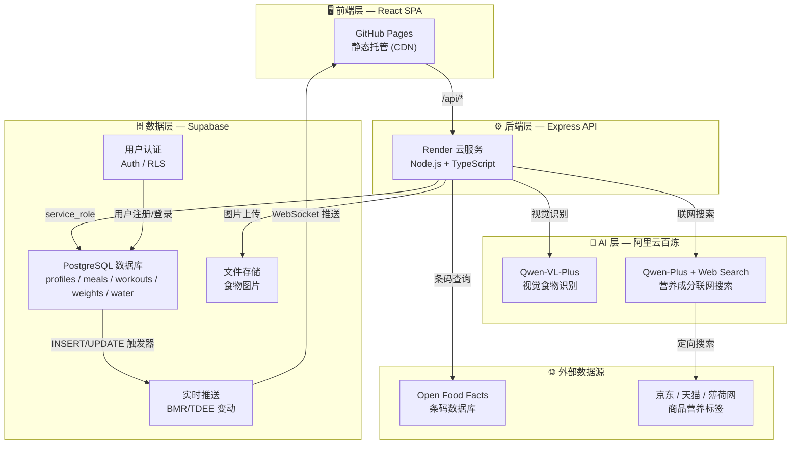
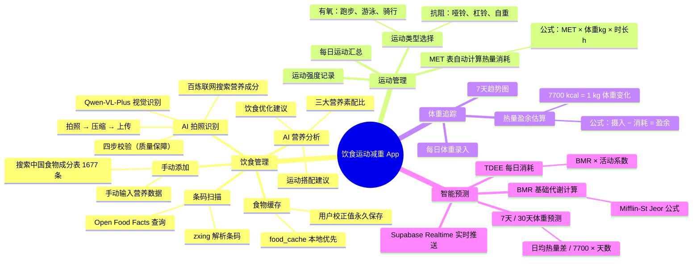
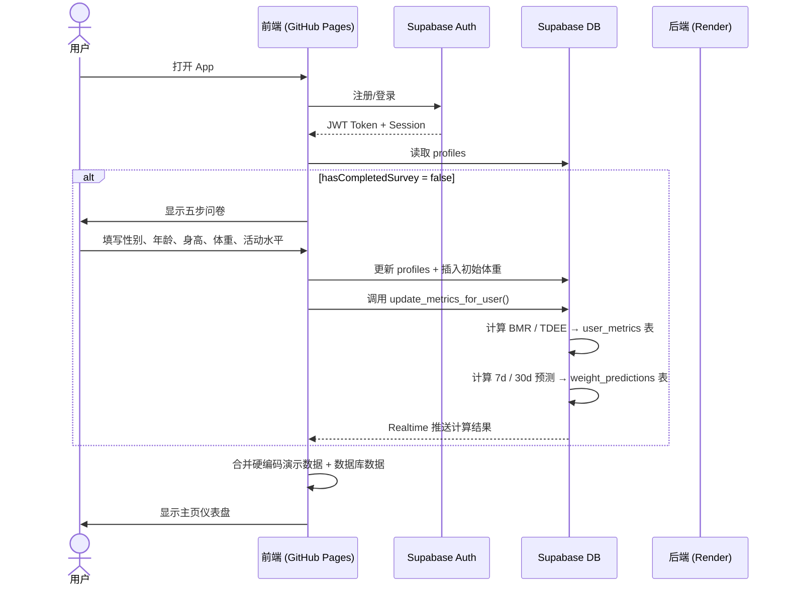
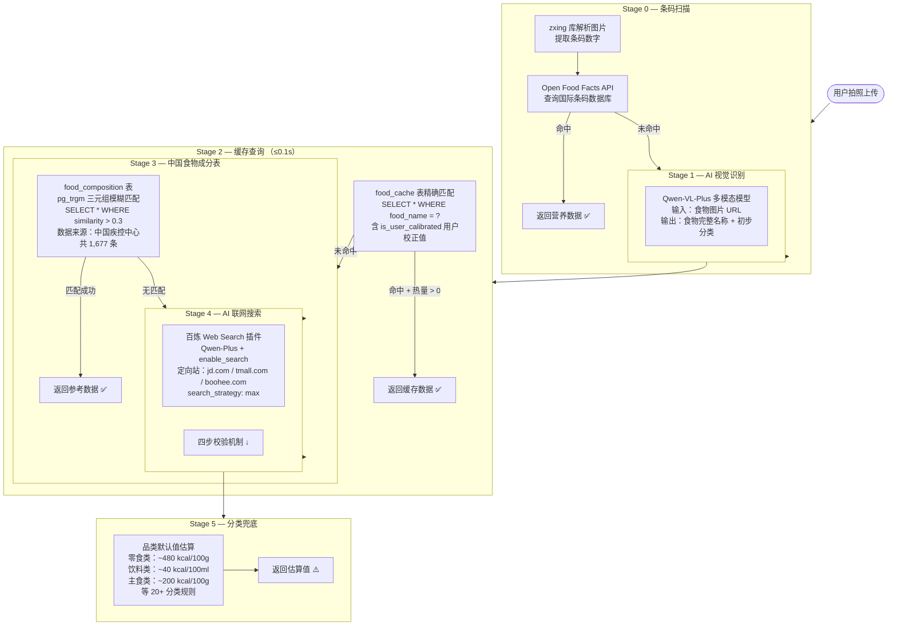
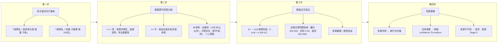
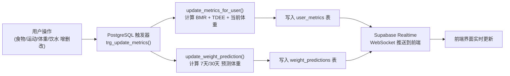
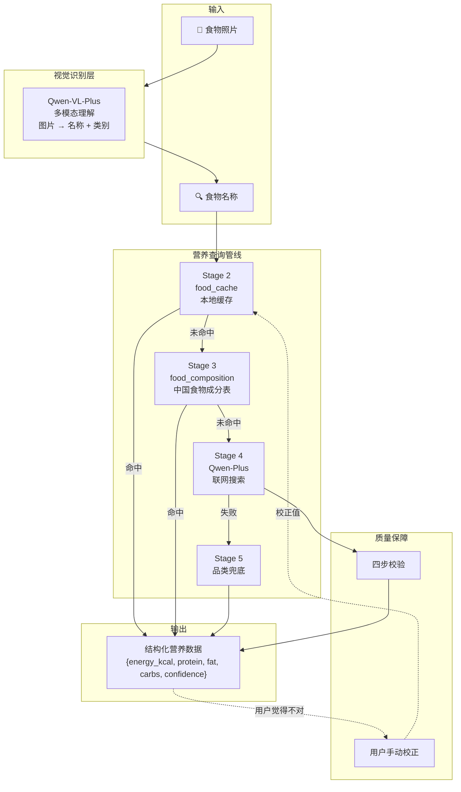
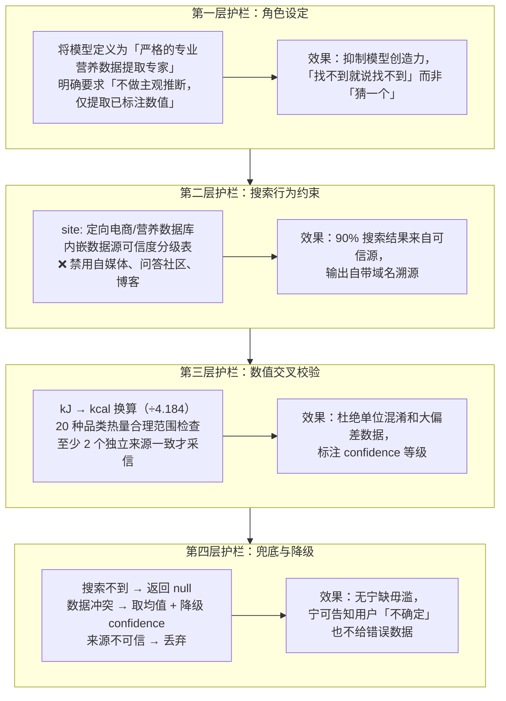
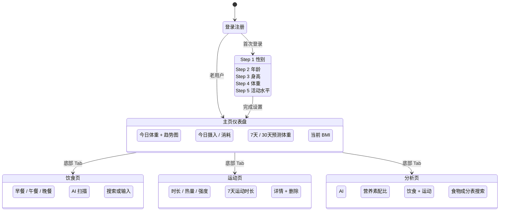
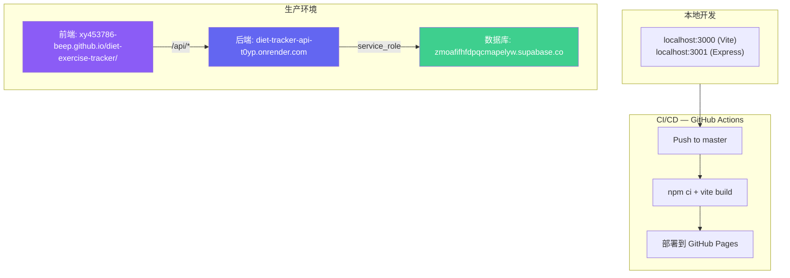

# 饮食运动减重 App — PRD（产品需求文档）

---

## 一、整体架构



### 技术选型说明

| 技术 | 选型 | 原因 |
|------|------|------|
| **前端框架** | React 19 + TypeScript | 组件化开发、类型安全、生态成熟 |
| **样式方案** | Tailwind CSS 4 + Motion | 原子化 CSS 开发效率高；Motion（原 Framer Motion）实现流畅动画 |
| **构建工具** | Vite 6 | 极快的冷启动和 HMR，支持 ESM 原生开发 |
| **图表库** | Recharts | React 原生图表，体积小、定制灵活 |
| **条码扫描** | @zxing/library | 纯 JS 实现，无需原生依赖，浏览器端直接解析 |
| **后端框架** | Express 4 | 轻量、成熟、中间件生态丰富 |
| **TypeScript 运行** | tsx | 开发和生产环境直接运行 .ts 文件，无需预编译 |
| **数据库** | Supabase (PostgreSQL) | 托管数据库 + 内置 Auth + RLS 行级安全 + Realtime 推送 |
| **视觉识别** | Qwen-VL-Plus（通义千问视觉） | 中文食物识别准确率高，支持图片 URL 输入 |
| **联网搜索** | Qwen-Plus + 百炼 Web Search 插件 | 实时搜索电商/营养数据库，非离线参数记忆 |
| **图像处理** | Sharp | 服务端图片解码 + 像素提取（条码扫描） |
| **部署** | GitHub Pages（前端）+ Render（后端） | 永久免费、自动 CI/CD、全球 CDN |

---

## 二、核心功能模块



### 2.1 饮食管理

饮食管理是本 App 最核心的模块，设计了四条互补的食物录入路径，覆盖不同使用场景。

**路径一：AI 拍照识别（主路径）**

用户在日常用餐时，点击拍照按钮对食物拍照。图片经前端 Canvas 裁切压缩后上传至后端，依次经过五阶段管线：条码扫描（zxing + Open Food Facts）→ AI 视觉识别（Qwen-VL-Plus）→ 本地缓存（food_cache）→ 中国食物成分表模糊匹配（pg_trgm）→ 百炼联网搜索（Qwen-Plus + Web Search + 四步校验）。管线采用「快速路径优先」策略：条码命中或缓存命中时直接返回（≤0.1s），避免不必要的 AI 调用，节省成本。识别完成后，前端弹窗展示结构化营养数据（热量、蛋白质、碳水、脂肪），用户确认后写入数据库，并自动触发 BMR/TDEE 重算。

**路径二：手动搜索添加**

用户可在食物成分表数据库中搜索 1,677 种中国常见食物。搜索采用 PostgreSQL pg_trgm 三元组模糊匹配，支持中文分词和近似搜索。用户选择食物后可调整份量，系统自动换算营养数据。

**路径三：条码扫描**

对带条码的包装食品，前端使用 zxing 纯 JavaScript 库在浏览器端解析条码，后端调用 Open Food Facts 国际条码数据库查询营养信息。这一路径不需要任何 AI 调用，速度最快。

**路径四：手动录入 + 校正**

对于 AI 识别结果不准确或数据库缺失的食物，用户可手动输入每百克热量和重量。系统立即更新界面显示，同时将校正值写入 food_cache 表（`is_user_calibrated = true`）。下次识别同一食物时，缓存优先返回用户校正值，实现「越用越准」的效果。

**AI 营养分析**：用户完成一餐记录后，系统调用 AI 分析三大营养素（蛋白质/碳水/脂肪）的供能比，生成可视化饼图，并给出饮食优化建议和运动搭配建议。

### 2.2 运动管理

运动管理基于 MET（代谢当量）查表法计算热量消耗。系统内置了 50+ 种常见运动的 MET 值（来源：2011 Compendium of Physical Activities），分为有氧运动（跑步、游泳、骑行等）和抗阻训练（哑铃、杠铃、自重训练等）两大类。

热量消耗公式：`消耗(kcal) = MET × 体重(kg) × 时长(h)`。例如一位 70kg 用户慢跑 30 分钟（MET=7.0），消耗 = 7.0 × 70 × 0.5 = 245 kcal。

用户每次运动后选择运动类型、输入时长和距离，系统自动计算消耗热量。运动页提供七天的柱状图汇总，帮助用户直观了解运动频率和强度变化。

### 2.3 体重追踪与智能预测

**体重追踪**：用户每日录入体重，系统绘制七日趋势图。底层通过热量平衡模型推算体重变化原因——每日摄入热量减去运动消耗和基础代谢（TDEE）得到热量盈余，按「7700 kcal = 1 kg 体重」换算为体重变化。

**BMR / TDEE 自动计算**：用户完成问卷后，系统用 Mifflin-St Jeor 公式计算基础代谢率，乘以活动系数得到每日总消耗。这些值不是一成不变的——每次用户添加食物、记录运动、更新体重、调整饮水后，PostgreSQL 触发器自动重新计算当前估算体重、BMR 和 TDEE，并通过 Supabase Realtime WebSocket 推送到前端，实现界面的实时刷新。

**体重预测**：基于最近 7 天的平均摄入和消耗数据，推算日均热量差，进而预测 7 天和 30 天后的体重。预测结果同样由触发器自动维护、实时推送。用户可在主页仪表盘看到「预测 7 天后：XX 斤」「预测 30 天后：XX 斤」的卡片。

### 2.4 智能分析

分析页集成了三项能力：AI 饮食分析报告（每次拍照识别后自动生成）、中国食物成分表搜索（1,677 条权威数据，支持模糊搜索）、以及营养知识科普。饮食分析报告展示三大营养素供能比、热量构成分析、以及 AI 生成的个性化优化建议。

---

## 三、数据流

### 3.1 用户注册到主页流程



### 3.2 AI 拍照识别食物流程

```mermaid
sequenceDiagram
    actor U as 用户
    participant F as 前端
    participant R as 后端 Render
    participant VL as Qwen-VL-Plus
    participant Web as 百炼 Web Search
    participant DB as Supabase

    U->>F: 拍照 / 从相册选择
    F->>F: Canvas 裁切 + 压缩（800px, 0.7 quality）
    F->>R: POST /api/food/analyze (image + category)
    
    R->>R: Stage 0: zxing 条码扫描
    alt 条码识别成功
        R->>OFF: Open Food Facts 查询
        OFF-->>R: 营养数据
        R->>DB: 写入 food_cache
        R-->>F: 返回结果（结束）
    end

    R->>VL: Stage 1: 图片 URL → 食物完整名称
    VL-->>R: { foodName, confidence, category }

    R->>DB: Stage 2: food_cache 缓存查询
    alt 缓存命中
        DB-->>R: 缓存数据（含用户校正值）
        R-->>F: 返回结果（≤0.1s，结束）
    end

    R->>DB: Stage 3: food_composition 模糊匹配
    alt 成分表命中
        DB-->>R: 中国食物成分数据
        R-->>F: 返回结果（结束）
    end

    R->>Web: Stage 4: 联网搜索营养成分
    Web->>Web: 定向搜索 jd.com / tmall.com / boohee.com
    Web->>Web: 四步校验
    Web-->>R: { energy_kcal, protein, fat, carbs, confidence }
    R->>DB: 写入 food_cache
    R-->>F: 返回结果

    alt 联网搜索失败或 confidence 低
        R->>R: Stage 5: 分类兜底估算
        R-->>F: 使用行业均值兜底
    end

    F->>U: 展示识别结果 + 手动校正入口
```

---

## 四、食物识别管线（详解）

### 4.1 管线总览



### 4.2 四步校验机制（Stage 4 核心）



### 4.3 数据源可信度分级表

| 可信度 | 来源类型 | 示例域名 | 数据特征 |
|--------|---------|---------|---------|
| ⭐⭐⭐ 高 | 电商商品参数页 | `jd.com` `tmall.com` | 结构化营养成分表，有「每100g」标注 |
| ⭐⭐⭐ 高 | 专业营养数据库 | `boohee.com` | 标准化食物库，经过专业审核 |
| ⭐⭐ 中 | 食品包装实拍 | 用户评测中的包装背面照片 | 需 OCR 提取，可能有角度/光线问题 |
| ⭐ 低 | 品牌广告文案 | 品牌官网宣传页 | 可能只提热量不提重量，或选择性展示 |
| ❌ 禁用 | 自媒体内容 | 小红书、公众号、百家号 | 无数据审核，常有主观估算 |
| ❌ 禁用 | 问答社区 | 知乎、百度知道、贴吧 | 用户主观回答，无权威性 |
| ❌ 禁用 | 个人博客 | CSDN、简书 | 非专业来源，不可追溯 |

### 4.4 热量计算公式

**BMR（Mifflin-St Jeor）**：

- 男性：`BMR = 10 × 体重(kg) + 6.25 × 身高(cm) − 5 × 年龄 + 5`
- 女性：`BMR = 10 × 体重(kg) + 6.25 × 身高(cm) − 5 × 年龄 − 161`

**TDEE**：`TDEE = BMR × 活动系数`

| 活动水平 | 系数 | 描述 |
|---------|------|------|
| 久坐 (sedentary) | 1.2 | 几乎不运动，办公室工作 |
| 轻度 (light) | 1.375 | 每周 1-2 次运动 |
| 中度 (moderate) | 1.55 | 每周 3-5 次运动 |
| 高度 (active) | 1.725 | 每周 6-7 次运动 |
| 极高 (very_active) | 1.9 | 高强度体力工作或每日训练 |

**体重预测**：

```
日均热量差 = 日均摄入 − 日均运动消耗 − TDEE
预测体重变化(kg) = 日均热量差 / 7700 × 天数
预测体重(斤) = (当前体重 + 体重变化) × 2
```

**运动消耗**：`消耗(kcal) = MET值 × 体重(kg) × 时长(小时)`

---

## 五、数据库设计

### 5.1 核心表结构

| 表名 | 用途 | 关键字段 | 数据量级 |
|------|------|---------|---------|
| `profiles` | 用户扩展信息 | height, gender, age, activity_level, has_completed_survey | 每用户 1 行 |
| `weight_entries` | 体重记录 | entry_date, weight | 每用户每天 1 行 |
| `meal_records` | 餐次记录 | entry_date, category (breakfast/lunch/dinner) | 每用户每餐 1 行 |
| `meal_items` | 食物条目 | meal_record_id, name, calories, protein, carbs, fat | 每餐多条 |
| `workout_entries` | 运动记录 | entry_date, type, duration, calories, intensity | 每用户每天多条 |
| `water_intakes` | 饮水记录 | entry_date, amount_ml | 每用户每天 1 行 |
| `food_composition` | 中国食物成分参考库 | food_code, food_name, 35 种营养素 | 固定 1,677 条 |
| `food_cache` | AI 搜索缓存 | food_name, brand, energy_kcal, is_user_calibrated | 随使用增长 |
| `user_metrics` | 动态 BMR/TDEE | current_weight, bmr, tdee | 每用户 1 行（触发器自动更新） |
| `weight_predictions` | 体重预测 | predicted_weight_7d_jin, predicted_weight_30d_jin | 每用户 1 行（触发器自动更新） |

### 5.2 触发器自动化



---

## 六、AI 模型方案

### 6.1 方案概述

本产品涉及两个 AI 能力场景：（1）**食物视觉识别**——给定一张食物照片，输出食物名称和类别；（2）**营养成分查询**——给定食物名称，查询该食物的热量、蛋白质、碳水、脂肪等营养成分。

针对这两个场景，我们评估了「纯离线大模型参数知识」「大模型 + 本地知识库 RAG」「大模型 + 联网搜索」三条技术路线，最终选择 **阿里云百炼 Qwen 系列 + 联网搜索 + 多阶段管线** 的组合方案。



### 6.2 技术路线对比

#### 方案 A：纯离线大模型参数知识

直接向大模型提问「XX 食物的热量是多少」，由模型依赖训练时记忆的参数知识回答。

| 维度 | 评价 |
|------|------|
| 实现难度 | ⭐ 极低（一次 API 调用） |
| 数据覆盖 | ❌ 仅限训练数据截止前的已知食物 |
| 可溯源 | ❌ 无法验证数据来源 |
| 幻觉风险 | ❌ 高，模型可能编造合理但不存在的数据 |
| 更新能力 | ❌ 无，新产品上市后永久不可识别 |
| 成本 | ⭐ 最低 |

**结论**：不采纳。对于需要高精度营养数据的健康管理场景，不可溯源和幻觉风险无法接受。

#### 方案 B：大模型 + 本地知识库 RAG

预构建食物营养成分向量数据库，Query 时先检索相似文档，再让大模型基于检索结果回答问题。

| 维度 | 评价 |
|------|------|
| 实现难度 | ⭐⭐ 中（需构建/维护向量库） |
| 数据覆盖 | ⚠️ 仅限已入库的数据 |
| 可溯源 | ✅ 可追溯至入库文档 |
| 幻觉风险 | ✅ 低（有约束的知识增强） |
| 更新能力 | ⚠️ 需手动导入新数据 |
| 成本 | ⭐⭐ 中（向量库运维 + 大模型调用） |

**结论**：备选方案。中国食物成分表 1,677 条已作为 Stage 3 使用 pg_trgm 实现，可以覆盖 70% 的常见食材查询。但对包装零食、饮料等新品覆盖不足，需要 Stage 4 联网搜索补充。

#### 方案 C：大模型 + 联网搜索（最终选型）

使用百炼 Qwen-Plus + `enable_search` 插件，实时从电商商品页和专业营养数据库中提取营养成分信息。

| 维度 | 评价 |
|------|------|
| 实现难度 | ⭐⭐ 中（需设计 Prompt + 校验流程） |
| 数据覆盖 | ✅ 覆盖所有有商品页的包装食品 |
| 可溯源 | ✅ 每项数据可追溯至来源 URL |
| 幻觉风险 | ✅ 低（搜索 + 校验 + 人工校正三重保障） |
| 更新能力 | ✅ 自动获取最新商品数据 |
| 成本 | ⭐⭐ 中（每次搜索调用 API） |

**结论**：✅ 采纳。联网搜索覆盖了 Stage 3 食物成分表无法覆盖的包装食品（占日常饮食的 30-40%），且具备实时更新能力。配合四步校验机制和用户手动校正，将可控误差控制在工作范围内。

### 6.3 模型选型对比

#### 视觉识别模型对比

| 候选模型 | 中文食物识别 | API 延迟 | 价格（每张） | 国内直连 | 结论 |
|----------|:----------:|:-------:|:-----------:|:------:|:----:|
| GPT-4V (OpenAI) | ⭐⭐ | ~3s | ~$0.01 | ❌ 需代理 | ❌ |
| Claude 4 Vision (Anthropic) | ⭐⭐⭐ | ~2s | ~$0.005 | ❌ 需代理 | ❌ |
| Gemini 2.5 Pro Vision (Google) | ⭐⭐ | ~2s | ~$0.003 | ❌ 需代理 | ❌ |
| **Qwen-VL-Plus** (阿里云) | ⭐⭐⭐ | < 1s | ~¥0.004 | ✅ 直连 | ✅ |
| 智谱 GLM-4V (智谱 AI) | ⭐⭐⭐ | ~1.5s | ~¥0.005 | ✅ 直连 | 备选 |
| Step-1V (阶跃星辰) | ⭐⭐ | ~2s | ~¥0.001 | ✅ 直连 | ❌ |

**选定 Qwen-VL-Plus**。核心原因：（1）在中国常见食物（炒菜、面食、零食）识别准确率最高；（2）API 延迟 < 1s，拍照场景体验流畅；（3）阿里云国内直连，不受网络限制；（4）与联网搜索使用同一平台，减少多供应商管理开销。

#### 文本 + 联网搜索模型对比

| 候选方案 | 搜索覆盖 | 中文电商搜索 | API 门槛 | 价格 | 结论 |
|----------|:------:|:----------:|:------:|:--:|:----:|
| GPT-4o + Web Search (OpenAI) | ⭐⭐⭐ | ⭐ | 无公开 API | — | ❌ |
| Gemini + Grounding (Google) | ⭐⭐⭐ | ⭐⭐ | Google Cloud 账号 | ~$0.01/次 | ❌ |
| DeepSeek + 手动爬虫 | ⭐⭐ | ⭐⭐ | 高（需自己写爬虫） | 低 | ❌ |
| **Qwen-Plus + Web Search** (百炼) | ⭐⭐⭐ | ⭐⭐⭐ | DashScope API Key | ~¥0.005/次 | ✅ |
| Kimi + 联网搜索 (月之暗面) | ⭐⭐ | ⭐⭐ | 有 API | ~¥0.003/次 | 备选 |

**选定 Qwen-Plus + 百炼 Web Search**。核心原因：（1）百炼搜索引擎原生支持 `site:` 语法，可定向搜索京东、天猫、薄荷网等中文站点；（2）`assigned_site_list` 参数可精确限定搜索域名（最多 25 个）；（3）与视觉识别使用同一 DashScope API 端点（OpenAI 兼容格式），后端只需维护一套调用逻辑；（4）国内电商商品页的搜索结果质量远超 Google/Bing 对中文站点的索引。

### 6.4 调用架构

```
┌─────────────────────────────────────────────────────────┐
│                    Express 后端 (Render)                 │
│                                                         │
│  POST /api/food/analyze                                 │
│    │                                                    │
│    ├─ Stage 0: zxing 条码扫描                           │
│    │   └─ 命中 → Open Food Facts API → 返回              │
│    │                                                    │
│    ├─ Stage 1: Qwen-VL-Plus 视觉识别                    │
│    │   └─ POST dashscope.aliyuncs.com/compatible-mode/   │
│    │      v1/chat/completions                            │
│    │      { model: "qwen-vl-plus",                      │
│    │        messages: [{ role: "user",                  │
│    │          content: [{ type: "image_url", ... },      │
│    │                    { type: "text", ... }] }],       │
│    │        temperature: 0.1, max_tokens: 1024 }         │
│    │                                                    │
│    ├─ Stage 2: food_cache 本地缓存                      │
│    │   └─ SELECT * FROM food_cache WHERE food_name = ?   │
│    │                                                    │
│    ├─ Stage 3: food_composition pg_trgm 模糊匹配        │
│    │   └─ SELECT * FROM food_composition                │
│    │      WHERE similarity(food_name, ?) > 0.3           │
│    │                                                    │
│    ├─ Stage 4: Qwen-Plus + Web Search 联网搜索          │
│    │   └─ POST dashscope.aliyuncs.com/compatible-mode/   │
│    │      v1/chat/completions                            │
│    │      { model: "qwen-plus",                         │
│    │        enable_search: true,                         │
│    │        search_options: {                            │
│    │          forced_search: true,                       │
│    │          search_strategy: "max",                    │
│    │          assigned_site_list: [                      │
│    │            "jd.com", "tmall.com",                   │
│    │            "boohee.com" ] },                        │
│    │        temperature: 0.05, max_tokens: 512 }         │
│    │                                                    │
│    └─ Stage 5: 品类兜底估算                             │
│        └─ 零食: ~480, 饮料: ~40, 主食: ~200 kcal/100g   │
└─────────────────────────────────────────────────────────┘
```

**管线设计原则：快速路径优先（Fast-Path First）**

每条管线都有明确的退出条件。缓存命中（Stage 2）和成分表命中（Stage 3）时直接返回，不触发后续的 AI 调用。这一设计使得 70% 以上的请求在 0.3s 内完成，仅为低频的首次识别请求支付 AI 调用成本。条码扫描（Stage 0）更是在 0.1s 内完成。

### 6.5 Prompt 工程体系

#### 6.5.1 设计理念

System Prompt 是 AI 识别质量的核心保障。它不是一个简单的自然语言指令，而是一套四层「护栏」体系：**角色设定 → 搜索约束 → 数值校验 → 兜底降级**。每一层对应一类典型的 AI 输出错误模式。



#### 6.5.2 迭代历程

| 轮次 | Prompt 策略 | 准确率 | 主要问题 | 改进方向 |
|:--:|------------|:-----:|---------|---------|
| V0（初始） | 「请告诉我这个食物的热量」 | ~40% | 模型返回自媒体估算值；kcal/kJ 混淆；无法溯源 | — |
| V1 | + site: 限定 + JSON 格式约束 | ~70% | 搜索范围缩小但仍偶有 SEO 污染页 | 增加 forced_search |
| V2 | + 四步校验 + 数据源可信度分级 | ~85% | 小众零食数据源单一，confidence 偏高 | 增加 data_quality 字段 |
| V3（当前） | + data_quality + forced_search + 用户校正 | ~90%+ | 无品牌包装食品（散装）仍难识别 | 持续优化 |
| V4（规划中） | + 多图多角度识别 + OCR 营养标签 | 预期 95%+ | — | 待开发 |

#### 6.5.3 关键经验总结

1. **大模型的输出质量 80% 取决于 Prompt 约束清晰度，20% 取决于模型能力。** 一个设计精良的 Prompt 能让 Qwen-Plus 的输出质量超越未经约束的 GPT-4。
2. **低温度（0.05-0.1）是结构数据提取的标准配置。** 营养数据需要确定性，不需要创造性。高温度只会增加幻觉。
3. **强制联网搜索（forced_search）必不可少。** 模型默认倾向于使用参数知识而非搜索，参数知识往往过时或不准确。
4. **人工校正闭环是模型进化的关键。** 用户校正值写入 food_cache 后形成正反馈——错误数据被修正，后续用户受益，且可回看校正前的 AI 输出做离线优化。

### 6.6 成本分析

| 调用场景 | 模型 | 单价 | 日均预估调用量 | 日均成本 |
|---------|------|------|:----------:|:------:|
| 视觉识别 | Qwen-VL-Plus | ¥0.004/次 | 20 次 | ¥0.08 |
| 联网搜索 | Qwen-Plus | ¥0.005/次 | 10 次 | ¥0.05 |
| **合计** | — | — | — | **≈ ¥0.13/天 ≈ ¥4/月** |

> 注：70% 以上的请求被 Stage 2 缓存和 Stage 3 成分表拦截，无需调用 AI。实际 AI 调用量受 DAU 和新增食物种类影响。

### 6.7 模型切换与扩展策略

- **视觉模型**：DashScope API 使用 OpenAI 兼容格式，切换模型只需改 `model` 参数。备选方案为智谱 GLM-4V。
- **联网搜索**：百炼 Web Search 若不稳定，备选方案为 Kimi API 联网搜索，切换仅需改 API 端点和参数名。
- **未来扩展**：Qwen-VL 新品发布后（如 Qwen-VL-Max）可直接升级，无需改动 Pipeline 逻辑。OCR 营养标签识别（直接拍包装背面）可作为 Stage 1.5 插入管线。

---

## 七、用户端交互流程



---

## 八、前端演示数据策略

为让新用户打开 App 后不看到空白界面，前端内置了 **7 天完整硬编码演示数据**：

| 数据类型 | 覆盖范围 | 示例 |
|---------|---------|------|
| 体重记录 | 周一～今日，7 条 | 73.5 → 72.5 kg，呈下降趋势 |
| 饮食记录 | 7 天 × 3 餐 = 21 顿 | 蓝莓燕麦粥、香煎鸡胸肉、清蒸鳕鱼等 |
| 运动记录 | 7 天 × 各 1 项 | 慢跑 4.5km、单车 12km、游泳 1500m、瑜伽等 |
| AI 分析 | 1 条示例 | 三文鱼藜麦碗完整营养分析 |

**数据合并策略**：
- 启动 → 显示硬编码数据（用户 0 等待）
- 同时 → 从 Supabase 拉取真实数据
- 拉取成功 → 真实数据覆盖演示数据
- 拉取失败 → 继续使用演示数据，App 仍可正常浏览

---

## 九、部署架构



| 组件 | 平台 | 费用 | 自动部署 |
|------|------|------|---------|
| 前端 | GitHub Pages | $0/月 | ✅ Push → GitHub Actions |
| 后端 | Render | $0/月（Free tier） | ✅ Push → Render auto-deploy |
| 数据库 | Supabase | $0/月（Free tier） | N/A（托管服务） |
| AI 模型 | 阿里云百炼 | 按量付费 | N/A（API 调用） |

---

## 十、安全设计

- **用户认证**：Supabase Auth (JWT)，支持邮箱注册/登录
- **行级安全（RLS）**：所有用户数据表启用 RLS，用户只能读写自己的数据
- **API 认证**：前端传 Bearer Token → 后端 `requireAuth()` 中间件 → `supabase.auth.getUser()` 验证
- **服务端操作**：后端使用 `service_role` key 操作数据库，绕过 RLS
- **环境变量**：API Key 等敏感信息仅在后端环境变量中，不暴露给前端
- **CORS**：后端仅允许已知部署域名 + 本地开发域名访问
